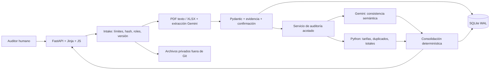

# Arquitectura y decisiones

**Implementado:** UI, contratos, casos de prueba normalizados, servicio de auditoría, extracción documental, persistencia SQLite WAL, reglas, modo simulado y adaptador Gemini, CI/CD y despliegue en Fly.io.

| ADR | Elección | Coste / revisión futura |
|---|---|---|
| 01 | Monolito, un proceso Python para demo | Cola durable solo con concurrencia real |
| 02 | FastAPI/Pydantic; Jinja + JS local | Sin build Node; HTMX opcional si simplifica formularios |
| 03 | Gemini detrás de SemanticProvider | SDK directo, sin framework de agentes |
| 04 | Flujo de trabajo con llamadas estructuradas acotadas | El modelo aporta evaluaciones; el servidor valida y ejecuta; no hay bucle abierto |
| 05 | Aritmética exacta; ausentes nulos | Desconocido no equivale a cero; redondeo estándar por línea |
| 06 | SQLite WAL + SQLAlchemy 2 + Alembic | Migrar a PostgreSQL si se requieren múltiples instancias |
| 07 | Volumen privado, IDs internos | Object storage al escalar horizontalmente; nombre nunca es ruta |
| 08 | Fly.io con TLS automático | Despliegue contenedor gestionado; sin servidor VPS manual |
| 09 | Demo con contraseña y tres casos visibles | El caso D sigue como regresión interna; no representa el flujo habitual |
| 10 | Subtotal de referencia | Impuestos y justificaciones no se resuelven restando anomalías |

## Responsabilidades

- `models.py`: única fuente de esquemas, sin I/O. Exportar contracts, no editarlos a mano.
- `audit/engine.py`: funciones puras; sin SDK IA, FastAPI, SQLAlchemy ni entorno.
- `agent/provider.py`: clasificar relaciones y validar citas; sin mutar importes.
- `services/audit_service.py`: integridad, checks financieros/semánticos, estado y reporte.
- `main.py`: transporte, límites y composición. Intake, extracción y repositorios en `app/api/documents.py` y `app/services/`.

## Reproducibilidad

Documentos inmutables por hash, selección activa por rol e `input_sha256` de entrada normalizada. La persistencia guardará snapshot, versiones de prompt/reglas/esquema, modelo resuelto, resultado, latencia y uso. Corregir extracción crea snapshot nuevo; nunca reescribe auditorías.

La evidencia une documento, localizador y texto. Implementado con línea/registro para casos de prueba y page/celda para PDF/XLSX. Verificar que la cita exista no garantiza respaldo semántico: requiere evaluación humana.

## Fallos y límites

422 entrada inválida; 413 exceso de bytes; 404 caso inexistente; 403 entrada personalizada deshabilitada.
LLM inaccesible, bloqueado, truncado o respuesta inválida → información requerida; conservar cálculos disponibles. Tarifa no única, unidad incompatible o totales inconciliables bloquean el subtotal de referencia.

Una llamada a IA por auditoría normalizada; timeout de 30 segundos y un intento por defecto. La clasificación y la extracción usan llamadas adicionales acotadas. Los casos rápidos usan una caché local; las auditorías de expedientes confirmados se guardan en SQLite. El presupuesto de llamadas es por proceso y se reinicia al arrancar: no es una cuota global ni un control de facturación. No hay degradación silenciosa a simulación.

La demo usa contraseña compartida para evaluación y límites de archivos. Antes de un uso comercial se requieren cuotas persistentes y gestión de usuarios; la contraseña publicada no proporciona confidencialidad frente a quien lee el README.

## Cotización, tarifario compartido y extracción Gemini

El tarifario estándar persiste en el volumen privado y se administra una vez con XLSX. Cada expediente nuevo recibe una copia inmutable por hash. Sustituir el estándar afecta solo a expedientes posteriores. La semilla es sintética y no acredita convenios comerciales.

La carga PDF sin rol solicita clasificación a Gemini, con una cita comprobable. El usuario puede corregir el rol; esto invalida la normalización anterior y obliga a extraer de nuevo. La extracción recibe texto por página, roles y el catálogo de tarifas; devuelve valores declarados como cadenas decimales, nulos y citas. No calcula dinero. El servidor valida página, documento activo, texto exacto, importes impresos y códigos del catálogo antes de persistir un candidato sin confirmar.

Clasificación, extracción y revisión semántica comparten el presupuesto acotado por proceso. En producción no se degrada silenciosamente al parser simulado cuando Gemini falla. La clasificación fallida permite elegir el rol manualmente; una extracción fallida bloquea la auditoría hasta reintentar y confirmar. Los PDF escaneados/OCR permanecen pendientes.

Los contratos de `app/models.py` y los esquemas exportados se conservan. La compatibilidad del transporte requiere nuevas rutas de corrección y configuración; la interfaz y los adaptadores cambian como dependencia del flujo solicitado.

La base de despliegue activa es `storage/sentria-v2.db`, inicializada con la migración Alembic `598193a64046`. La base antigua incompatible `storage/sentria.db` se conserva intacta para recuperación; no se presenta como migración de sus datos. Un fallo de migración impide arrancar, en vez de cambiar silenciosamente a `/tmp`.
