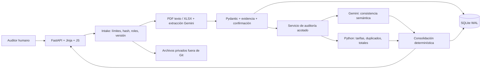

# Arquitectura y decisiones

**Implementado:** UI, contratos, casos de prueba normalizados, servicio de auditoría, extracción documental, persistencia SQLite WAL, reglas, modo simulado y adaptador Gemini, CI/CD y despliegue en Fly.io.

| ADR | Elección | Coste / revisión futura |
|---|---|---|
| 01 | Monolito, un proceso Python para demo | Cola durable solo con concurrencia real |
| 02 | FastAPI/Pydantic; Jinja + JS local | Sin build Node; HTMX opcional si simplifica formularios |
| 03 | Gemini detrás de SemanticProvider | SDK directo, sin framework de agentes |
| 04 | Flujo de trabajo con llamadas estructuradas acotadas | El modelo aporta evaluaciones; el servidor valida y ejecuta; no hay bucle abierto |
| 05 | Aritmética exacta; ausentes nulos | Desconocido no equivale a cero; redondeo estándar por línea |
| 06 | SQLite WAL + SQLAlchemy 2 + Alembic | Migrar a PostgreSQL si se requieren múltiples instancias |
| 07 | Volumen privado, IDs internos | Object storage al escalar horizontalmente; nombre nunca es ruta |
| 08 | Fly.io con TLS automático | Despliegue contenedor gestionado; sin servidor VPS manual |
| 09 | Demo pública con cuatro casos de prueba | Entrada libre requiere autenticación, cuotas y validación de archivos |
| 10 | Subtotal de referencia | Impuestos y justificaciones no se resuelven restando anomalías |

## Responsabilidades

- `models.py`: única fuente de esquemas, sin I/O. Exportar contracts, no editarlos a mano.
- `audit/engine.py`: funciones puras; sin SDK IA, FastAPI, SQLAlchemy ni entorno.
- `agent/provider.py`: clasificar relaciones y validar citas; sin mutar importes.
- `services/audit_service.py`: integridad, checks financieros/semánticos, estado y reporte.
- `main.py`: transporte, límites y composición. Intake, extracción y repositorios en `app/api/documents.py` y `app/services/`.

## Reproducibilidad

Documentos inmutables por hash, selección activa por rol e `input_sha256` de entrada normalizada. La persistencia guardará snapshot, versiones de prompt/reglas/esquema, modelo resuelto, resultado, latencia y uso. Corregir extracción crea snapshot nuevo; nunca reescribe auditorías.

La evidencia une documento, localizador y texto. Implementado con línea/registro para casos de prueba y page/celda para PDF/XLSX. Verificar que la cita exista no garantiza respaldo semántico: requiere evaluación humana.

## Fallos y límites

422 entrada inválida; 413 exceso de bytes; 404 caso inexistente; 403 entrada personalizada deshabilitada.
LLM inaccesible, bloqueado, truncado o respuesta inválida → información requerida; conservar cálculos disponibles. Tarifa no única, unidad incompatible o totales inconciliables bloquean el subtotal de referencia.

Una llamada a IA por auditoría normalizada; 30 s de timeout, 3000 tokens de salida y un intento por defecto. Cuatro casos de prueba almacenados en memoria por proceso. Reiniciar invalida la caché y el presupuesto: el límite local no es cuota global ni control de facturación. Un error almacenado requiere reinicio para reintentar. No hay modo silencioso de degradación.

Antes de habilitar carga de archivos pública: presupuesto e idempotencia persistidos por hash+modelo+prompt, límite de concurrencia y tiempo máximo de trabajo. No abrir ingreso libre hasta completar controles.
