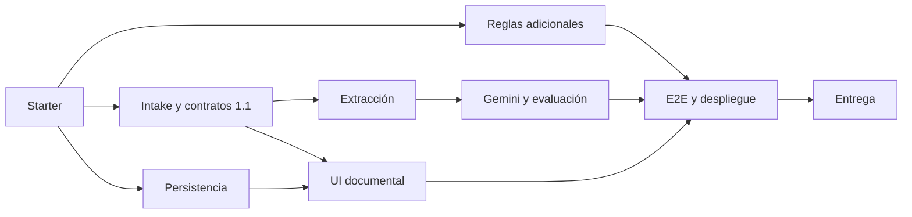

# Plan de implementación para hoy

Objetivo: que una persona cargue siniestro, inspección, factura/cotización y tarifario, confirme datos ambiguos y reciba hallazgos con evidencia mediante Gemini en una URL pública HTTPS. Estimación de **8-10 horas de equipo**, a partir del starter; no es promesa de entrega ni prórroga del evento.

## Estado de partida

T00 preparado: demo JSON A-D, motor, contratos, adaptador Gemini, UI guiada, pruebas, lock/CI y desplegado en Fly.io. Consulta `verification.md` para resultados ejecutados.

## Roles propuestos

| Integrante | Coordinación propuesta | Resultado que integra |
|---|---|---|
| Eduardo Valle | Contratos, Gemini, integración y publicación | Pipeline completo, controles de IA y revisión de contratos |
| Jose Muñoz | Documentos, persistencia y motor | Extracción trazable, integridad, importes y tests |
| Santiago López | Plataforma, dataset y demostración | Upload/confirmación/resultados, evidencia y guía |

No se asigna seniority. Los agentes ejecutan unidades acotadas; la persona responsable revisa el diff y los criterios. El integrador controla `app/models.py`, `main.py`, dependencias y compose; así se evitan colisiones.

## Camino crítico y paralelo

| Tiempo desde inicio | Trabajo | Puerta de salida |
|---|---|---|
| 0:00-0:30 | Equipo ejecuta demo y make check; selecciona modelo disponible; confirma alcance/roles | Baseline repetible; fuentes y fecha revisadas |
| 0:30-2:00 | T01 intake + T03 DB + T04 reglas en archivos separados | Contrato 1.1 acordado, archivos rechazados/aceptados, migración y reglas |
| 2:00-4:00 | T02 extracción; T06 UI con casos de prueba; integrar repositorios | Datos con fuente por campo y edición humana |
| 4:00-5:30 | T05 Gemini real; UI deja modo simulado solo en demo | Revisión real, manejo de errores y límites comprobados |
| 5:30-7:00 | T07 corpus reservado, E2E, correcciones e imagen final | Cero falsos candidatos críticos; A-D desde documentos |
| 7:00-8:00 | Despliegue en Fly.io, prueba desde navegador externo, T08 | URL HTTPS, repo visible, PDF actualizado |
| 8:00-10:00 | Reserva para SDK, OCR no incluido, DNS, extracción defectuosa | Resolver elementos prioritarios; no ampliar alcance |

## Tareas listas para encargar

| ID | Documento | Dependencias | Complejidad / contexto sugerido |
|---|---|---|---|
| T01 | [Intake](tasks/T01-intake.md) | T00 | Media, 6-10k tokens |
| T02 | [Extracción](tasks/T02-extraction.md) | T01 | Alta, 8-14k |
| T03 | [Persistencia](tasks/T03-persistence.md) | Contratos T01 | Media, 6-10k |
| T04 | [Motor](tasks/T04-engine.md) | T00 | Media, 5-8k |
| T05 | [Gemini](tasks/T05-agent.md) | T02/T04 | Alta, 6-12k |
| T06 | [UI](tasks/T06-ui.md) | T01/T03, casos de prueba T02 | Media, 6-10k |
| T07 | [Evaluación y despliegue](tasks/T07-release.md) | T02-T06 | Alta, 8-12k |
| T08 | [Entrega](tasks/T08-delivery.md) | T07 | Baja, 3-5k |

Tokens son presupuestos iniciales de contexto, no gasto medido ni límites de la plataforma. La guía de OpenCode describe cómo reducir relecturas y escalar solo lo necesario.

## Definition of Done del MVP

- Crear expediente y subir cuatro documentos, incluido al menos un ejemplo realista de factura sintética.
- Tipos/versiones y extracción confirmables; PDF ilegible y faltantes visibles.
- Tarifario normalizado por código, unidad, moneda, taller y vigencia cuando existan.
- Gemini interpreta consistencia; Python calcula; tres estados con precedencia.
- Cada hallazgo remite a fuente verificable; diferencias sin doble conteo.
- A-D ejecutados desde archivos; caso no visto y fallos del proveedor evaluados.
- UI señala información faltante, procesamiento, errores y próximo paso; reporte descargable.
- CI verde; commit identificable desplegado en Fly.io con HTTPS verificado desde red externa.
- Guía para jurados, repo accesible y PDF de herramientas completo; modo real claramente identificado.

Si el tiempo se agota: priorizar un flujo documental estrecho y honesto (PDF con texto + XLSX plantilla). Mantener archivos escaneados como no soportados; no simular extracción exitosa. Resolver el flujo principal antes de ampliar a fotos, chat o paneles de análisis. Una demo únicamente simulada sirve para desarrollar, no satisface por sí sola un agente IA funcional final.
